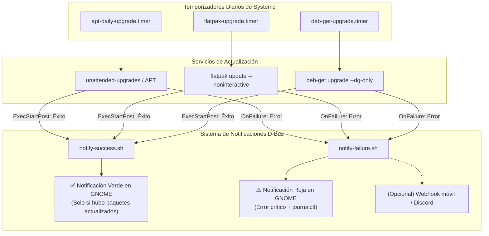

# Debian Unattended Upgrades & Notifications

Este repositorio contiene una solución integral, modular y probada para mantener un sistema **Debian 13 (Trixie)** totalmente actualizado de forma automática y desatendida, abarcando todos los ecosistemas de empaquetado comunes y proporcionando retroalimentación visual inmediata en el entorno de escritorio.

---

## ¿En qué consiste este proyecto?

En una estación de trabajo Linux moderna coexisten habitualmente tres vías de instalación de software:
1. **Paquetes base del sistema (APT)**: Actualizaciones del kernel, librerías del sistema y herramientas de consola.
2. **Aplicaciones aisladas en contenedor (Flatpak)**: Runtimes gráficos y software de escritorio de Flathub.
3. **Software de terceros descargado en `.deb` sueltos**: Aplicaciones populares como Discord, Obsidian, Ente Auth, Heroic Launcher u OpenRGB, que habitualmente no configuran repositorio propio y quedan huérfanas ante actualizaciones del sistema.

Este repositorio orquesta la actualización periódica de estos tres frentes mediante **temporizadores de Systemd** e integra un **motor de notificaciones nativas en el escritorio GNOME (vía D-Bus)** que:
* **Informa de novedades reales**: Te avisa cuando se instalan versiones nuevas o parches, detallando qué componentes cambiaron (evitando notificaciones vacías diarias cuando no hay cambios).
* **Alerta de incidentes críticos**: Si una actualización falla (por problemas de red, repositorios caídos o claves GPG caducadas), lanza una alerta visual en pantalla y permite enviar un webhook a tu móvil/Discord.

---

## Arquitectura General



---

## Índice de Documentación

Para consultar en detalle la teoría, configuración paso a paso y resolución de incidencias de cada componente, revisa las siguientes guías dedicadas:

1. [**Fase 1: Actualizaciones Desatendidas de APT**](docs/01-apt-unattended.md)  
   Instalación y configuración de `unattended-upgrades`, definición de orígenes de seguridad (`Origins-Pattern`), limpieza automática de librerías y kernels huérfanos, y control de reinicios.

2. [**Fase 2: Actualizaciones Automáticas de Flatpak**](docs/02-flatpak-unattended.md)  
   Creación del servicio y temporizador de systemd para actualizar Flatpaks de forma desatendida con privilegios adecuados para desplegar runtimes del sistema (Nvidia, VAAPI, Mesa).

3. [**Fase 3: Gestión y Actualización de `.deb` Manuales con `deb-get`**](docs/03-deb-get-unattended.md)  
   Auditoría de paquetes locales, instalación de `deb-get`, adopción de software existente (Discord, Obsidian, etc.), resolución del fallo de rotación de claves GPG de Spotify en Debian 13 y automatización segura con `--dg-only`.

4. [**Fase 4: Sistema de Notificaciones de Éxito y Fallo**](docs/04-notifications.md)  
   Implementación de `notify-failure.sh` y `notify-success.sh`, comunicación con la sesión gráfica del usuario mediante D-Bus, prevención de fatiga de alertas mediante detección inteligente de cambios y drop-ins en systemd.

5. [**Guía de Comprobaciones, Auditoría y Troubleshooting**](docs/05-troubleshooting-and-checks.md)  
   Instrucciones para comprobar de forma forense e independiente en los logs de Linux si el sistema corrió, si estaba al día, qué paquetes se instalaron y cómo resolver incidentes comunes (claves GPG, bloqueos de dpkg o caídas de red).

---

## Estructura del Repositorio

```text
.
├── README.md                      # Esta guía principal
├── install.sh                     # Script de despliegue automatizado
├── docs/
│   ├── 01-apt-unattended.md       # Documentación de APT
│   ├── 02-flatpak-unattended.md   # Documentación de Flatpak
│   ├── 03-deb-get-unattended.md   # Documentación de deb-get y paquetes huérfanos
│   ├── 04-notifications.md       # Documentación del sistema de notificaciones
│   └── 05-troubleshooting-and-checks.md # Auditoría independiente y resolución de problemas
├── scripts/
│   ├── audit-manual-debs.py       # Utilidad para detectar .deb huérfanos
│   ├── notify-failure.sh          # Gestor de alertas por fallo
│   ├── notify-success.sh          # Gestor de avisos por éxito
│   └── test-and-verify.sh         # Suite de diagnóstico, pruebas y verificación completa
└── systemd/
    ├── apt-daily-upgrade.override.conf  # Drop-in override para APT
    ├── deb-get-upgrade.service          # Servicio para deb-get
    ├── deb-get-upgrade.timer            # Temporizador para deb-get
    ├── flatpak-upgrade.service          # Servicio para Flatpak
    ├── flatpak-upgrade.timer            # Temporizador para Flatpak
    └── notify-failure@.service          # Servicio plantilla de alerta
```

---

## Despliegue Rápido (Quick Start)

Si deseas aplicar esta configuración en una instalación limpia o en otro equipo:

```bash
git clone https://github.com/tu-usuario/debian-unattended-upgrades_and_notify.git
cd debian-unattended-upgrades_and_notify
sudo ./install.sh
```

---

## Diagnóstico y Verificación del Sistema

Puedes verificar en cualquier momento que todo está funcionando correctamente, los temporizadores están activos y las notificaciones se muestran en tu pantalla ejecutando el script de diagnóstico:

```bash
sudo ./scripts/test-and-verify.sh
```

Este script realiza 6 fases de comprobación:
1. **Dependencias**: Comprueba que APT, Flatpak, deb-get y libnotify estén disponibles.
2. **Permisos y D-Bus**: Valida que los scripts en `/usr/local/bin` sean ejecutables y detecta el socket de sesión de GNOME.
3. **Timers**: Informa del estado de los 3 temporizadores y de la hora exacta de su próxima ejecución.
4. **Prueba de Notificaciones en Vivo**: Lanza una notificación **roja** (simulación de fallo) y una notificación **verde** (simulación de éxito) directamente a tu escritorio.
5. **Motores de Actualización**: Ejecuta una simulación en seco (`dry-run`) de APT, comprueba actualizaciones en Flatpak y lista las aplicaciones gestionadas por deb-get.
6. **Resumen de Salud**: Muestra un cuadro consolidado del estado del sistema.

---

## Comandos Útiles de Monitorización

* **Ver el estado de los temporizadores activos:**
  ```bash
  systemctl list-timers deb-get-upgrade.timer flatpak-upgrade.timer apt-daily-upgrade.timer
  ```

* **Comprobar qué aplicaciones están bajo el control de `deb-get`:**
  ```bash
  deb-get list --installed
  ```

* **Auditar paquetes manuales sin repositorio:**
  ```bash
  python3 scripts/audit-manual-debs.py
  ```

* **Revisar logs de cualquier servicio:**
  ```bash
  journalctl -u deb-get-upgrade.service -e
  journalctl -u flatpak-upgrade.service -e
  journalctl -u apt-daily-upgrade.service -e
  ```