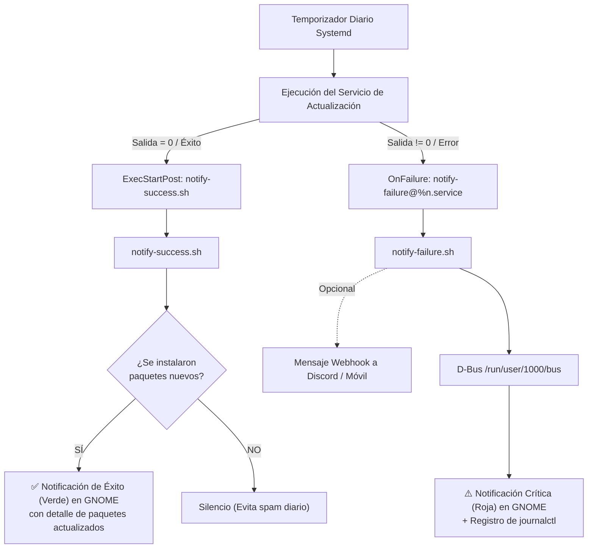

# Fase 4: Sistema de Notificaciones de Éxito y Fallo

Las actualizaciones desatendidas que se ejecutan en segundo plano plantean dos riesgos si no existe retroalimentación:
1. **Fallo silencioso**: Un error de red, un repositorio caído o un problema criptográfico con claves GPG detendrían las actualizaciones sin que el usuario se entere.
2. **Fatiga de notificaciones**: Recibir múltiples notificaciones diarias diciendo *"No hay nada que actualizar"* hace que el usuario termine ignorando o desactivando los avisos.

Para solucionar ambos problemas, implementamos una arquitectura de notificaciones reactiva con **Systemd** y **D-Bus / GNOME Desktop**.

---

## 1. Arquitectura del Sistema



---

## 2. Requisitos previos

Para poder enviar notificaciones gráficas desde la línea de comandos, necesitamos `notify-send`:

```bash
sudo apt install libnotify-bin
```

---

## 3. Notificaciones de Fallo (`notify-failure`)

### 3.1. Script `/usr/local/bin/notify-failure.sh`
Este script se ejecuta cuando cualquier servicio asociado termina con un código de error:
1. Extrae las últimas líneas del log del servicio desde `journalctl`.
2. Conecta con el bus de sesión D-Bus del usuario activo en el escritorio (`eddy`, UID `1000`).
3. Emite una notificación persistente de urgencia crítica (`-u critical`) con icono de diálogo de error.

```bash
#!/bin/bash
FAILED_UNIT="${1:-servicio-desconocido}"
LOG_SNIPPET=$(journalctl -u "$FAILED_UNIT" -n 8 --no-pager -o cat 2>/dev/null)

USER_ID="1000"
USER_NAME="eddy"

if [ -e "/run/user/${USER_ID}/bus" ]; then
    sudo -u "$USER_NAME" \
        DBUS_SESSION_BUS_ADDRESS="unix:path=/run/user/${USER_ID}/bus" \
        notify-send -u critical -i dialog-error \
        "⚠️ Fallo en Actualización Desatendida" \
        "El servicio ${FAILED_UNIT} ha fallado.\nRevisa el log con: journalctl -u ${FAILED_UNIT} -e"
fi

# (Opcional) Webhook de Discord:
# DISCORD_WEBHOOK="https://discord.com/api/webhooks/..."
# if [ -n "$DISCORD_WEBHOOK" ]; then
#     curl -s -H "Content-Type: application/json" -X POST \
#         -d "{\"content\": \"⚠️ **Fallo en ${FAILED_UNIT}:**\n\`\`\`\n${LOG_SNIPPET}\n\`\`\`\"}" \
#         "$DISCORD_WEBHOOK" > /dev/null
# fi
```

Permisos:
```bash
sudo chmod +x /usr/local/bin/notify-failure.sh
```

### 3.2. Servicio plantilla Systemd (`/etc/systemd/system/notify-failure@.service`)
Permite invocar el script pasando dinámicamente el nombre de la unidad fallida (`%i`):

```ini
[Unit]
Description=Notificar fallo del servicio %i

[Service]
Type=oneshot
ExecStart=/usr/local/bin/notify-failure.sh %i
```

---

## 4. Notificaciones de Éxito Inteligentes (`notify-success`)

### 4.1. Script `/usr/local/bin/notify-success.sh`
Para evitar el molesto spam de recibir 3 notificaciones cada mañana avisando de que nada ha cambiado, el script implementa **detección de cambios**:
* Analiza si la salida del servicio o los logs reflejan paquetes instalados o actualizados (`Instalando`, `Desempaquetando`, `Upgraded`).
* Si hubo actualizaciones reales, muestra la notificación con el detalle del software actualizado.
* Si el sistema ya estaba al día, termina silenciosamente (a menos que configures `NOTIFY_ALWAYS=true`).

```bash
#!/bin/bash
UNIT="${1:-servicio-desconocido}"
USER_ID="1000"
USER_NAME="eddy"

if [ ! -e "/run/user/${USER_ID}/bus" ]; then
    exit 0
fi

NOTIFY_ALWAYS=false

LOG_LINES=$(journalctl -u "$UNIT" -n 35 --no-pager -o cat 2>/dev/null)
DID_UPDATE=false
DETAILS=""

case "$UNIT" in
    *flatpak*)
        if echo "$LOG_LINES" | grep -Ei "Instalando|Actualizando|Installing|Updating" | grep -v "appstream" > /dev/null; then
            DID_UPDATE=true
            DETAILS="Flatpak ha actualizado aplicaciones y componentes con éxito."
        else
            DETAILS="Flatpak: Todo el software está al día."
        fi
        ;;
    *deb-get*)
        if echo "$LOG_LINES" | grep -Ei "Desempaquetando|Unpacking|was updated|Configurando|Setting up" > /dev/null; then
            DID_UPDATE=true
            DETAILS="deb-get ha instalado nuevas versiones de tus aplicaciones con éxito."
        else
            DETAILS="deb-get: Todas las aplicaciones compatibles están al día."
        fi
        ;;
    *apt*)
        APT_LOG="/var/log/unattended-upgrades/unattended-upgrades.log"
        if [ -f "$APT_LOG" ] && grep -Ei "All upgrades installed|Instalados|Upgrade:" "$APT_LOG" 2>/dev/null | tail -n 5 | grep -qv "No packages"; then
            DID_UPDATE=true
            DETAILS="APT: Se han aplicado actualizaciones y parches de Debian con éxito."
        else
            DETAILS="APT: El sistema Debian está al día."
        fi
        ;;
    *)
        DID_UPDATE=true
        DETAILS="El servicio ${UNIT} se ha completado con éxito."
        ;;
esac

if [ "$DID_UPDATE" = true ] || [ "$NOTIFY_ALWAYS" = true ]; then
    sudo -u "$USER_NAME" \
        DBUS_SESSION_BUS_ADDRESS="unix:path=/run/user/${USER_ID}/bus" \
        notify-send -u normal -t 6000 -i software-update-available \
        "✅ Actualización completada" \
        "$DETAILS"
fi
```

Permisos:
```bash
sudo chmod +x /usr/local/bin/notify-success.sh
```

---

## 5. Integración con los Servicios de Actualización

### 5.1. En `deb-get-upgrade.service` y `flatpak-upgrade.service`
Añade en la sección `[Unit]` y `[Service]`:
```ini
[Unit]
...
OnFailure=notify-failure@%n.service

[Service]
...
ExecStartPost=/usr/local/bin/notify-success.sh %n
```

### 5.2. En `apt-daily-upgrade.service` (Drop-in Override)
Dado que `apt-daily-upgrade` es gestionado por el paquete oficial del sistema, aplicamos la configuración mediante un override en `/etc/systemd/system/apt-daily-upgrade.service.d/override.conf`:

```ini
[Unit]
OnFailure=notify-failure@%n.service

[Service]
ExecStartPost=/usr/local/bin/notify-success.sh %n
```

Aplica los cambios en el sistema:
```bash
sudo systemctl daemon-reload
```

---

## 6. Pruebas de Funcionamiento

### Probar Notificación de Fallo
Dispara manualmente el servicio de plantilla con un nombre ficticio:
```bash
sudo systemctl start notify-failure@test-upgrade.service
```
*Resultado*: Verás una notificación roja crítica en el escritorio indicando que `test-upgrade` falló.

### Probar Notificación de Éxito
Ejecuta el script directamente pasándole un servicio:
```bash
sudo /usr/local/bin/notify-success.sh test-upgrade.service
```
*Resultado*: Verás una notificación verde informando de la finalización con éxito.
